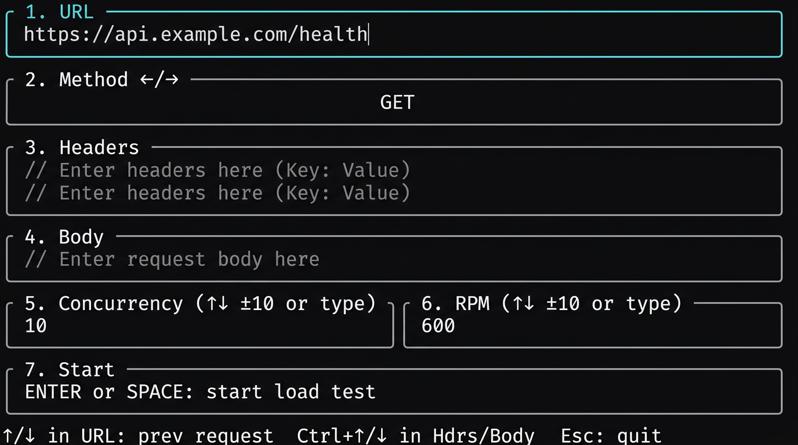
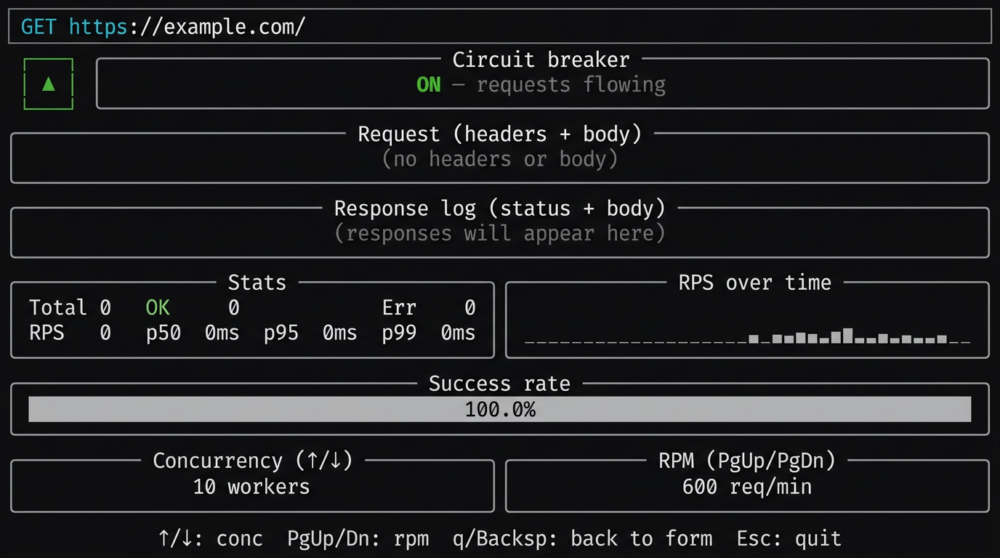

# stress-riser

Beautiful Rust stress tester with a form (URL, method, headers, body) and a
live TUI: stats, circuit breaker, and sparklines.

## Screenshots

**Form** — URL, method, headers, body, concurrency, RPM. Enter to start.



**Dashboard** — Live stats, circuit breaker, RPS sparkline, success rate.



*(Dashboard image is a mockup; for a real capture run `just`, start a load test,
then screenshot your terminal.)*

## Install

```bash
cargo install --path .
```

Or clone the repo (or extract the archive you were sent). From the project root:

```bash
cargo build --release
```

All development and run tasks use [just](https://github.com/casey/just); run
`just` with no arguments to start the app.

## Usage

Run with no CLI arguments:

```bash
just
# or: cargo run
```

The app has two phases:

1. **Form** — Enter URL, method, headers, body, concurrency, and RPM. Start the
   load test with Enter.
2. **Dashboard** — Live load test with real-time stats. Return to the form with
   q or Backspace; quit the app with Esc.

### Keybindings

**Form**

| Key           | Action                          |
|---------------|----------------------------------|
| Tab           | Next field                       |
| Shift+Tab     | Previous field                   |
| Enter         | Start load test (when URL set)   |
| ↑/↓ (in URL)  | Cycle through request history    |
| Ctrl+↑/↓ (Headers/Body) | Cycle request history  |
| Esc           | Quit                             |

**Dashboard**

| Key        | Action                    |
|------------|---------------------------|
| ↑/↓        | Concurrency (±10)         |
| PgUp/PgDn  | RPM (±10)                 |
| q / Backspace | Back to form            |
| Esc        | Quit                      |

## Config / data

History is stored in:

- `$XDG_DATA_HOME/stress-riser/history.json` if `XDG_DATA_HOME` is set
- Otherwise `~/.local/share/stress-riser/history.json`
- Otherwise `./stress-riser/history.json`

Persistence is best-effort; missing or invalid files are ignored.

## Examples

Enter a URL (e.g. `https://example.com`) in the URL field, choose method
(GET, POST, etc.), add headers and body in their fields, then start the
load test.

## Publishing to crates.io

1. Set `repository`, `homepage`, and optionally `authors` in `Cargo.toml`.
2. Log in once: `cargo login` (use a token from crates.io → Account Settings).
3. Run the gate: `just publish-check` (fmt, clippy, tests, dry-run).
4. Publish: `just publish`.

Optional: `just package` builds the `.crate` in `target/package/` for
inspection before uploading.

## Development

| Command        | Description              |
|----------------|--------------------------|
| `just`         | Run the app              |
| `just test`     | Run tests                |
| `just fmt`      | Format code              |
| `just check`    | Check + clippy            |
| `just doc`         | Build and open API docs   |
| `just publish-check` | Fmt, clippy, test, dry-run publish |
| `just publish`     | Publish to crates.io      |
